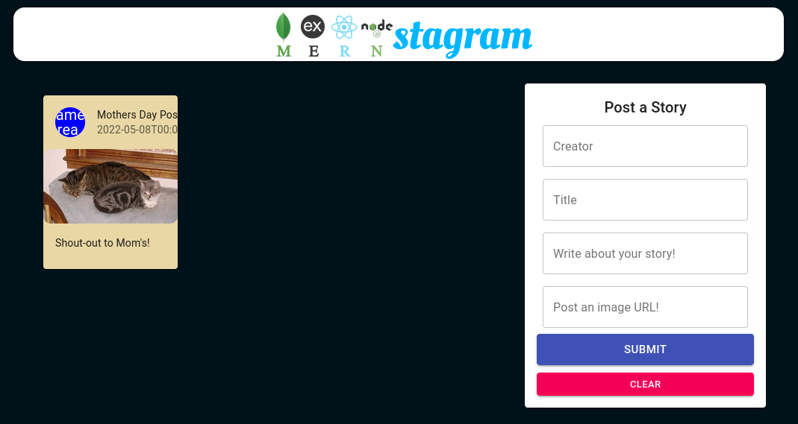

### MERNstagram ###

A full-stack social media clone application.

Technologies Used:

[PostgreSQL](https://www.postgresql.org/) - Open source object-relational Database for persistent data

[Express](https://expressjs.com/) - Node.js web framework

[React](https://reactjs.org/) - Javascript library for building user interfaces

[Node.js](https://nodejs.org) - Javascript runtime built on Chrome's V8 Javascript engine

[Material UI](https://mui.com/) - A React Component styling library

This app is deployed in three locations:

[Front-end (client side)](https://mernstagram.netlify.app/) - Hosted on [Netlify](https://www.netlify.com/)

- Documentation for front-end can be found [here](https://github.com/BenjaminBanwart/MERNstagram/tree/main/client#readme)

[Back-end (server side)](https://mernstagram-api.herokuapp.com/) - Hosted on [Heroku](https://www.heroku.com)

- Documentation for back-end can be found [here](https://github.com/BenjaminBanwart/MERNstagram/tree/main/server#readme)

[Database](https://www.elephantsql.com/) - Hosted on ElephantSQL which offers PostgreSQL as a Service

Future Features:

- Implement S3 Bitbucket for image hosting. Currently our database only allows for 20 mb of data so we cannot upload pictures directly to it. 

- Mobile compatability
