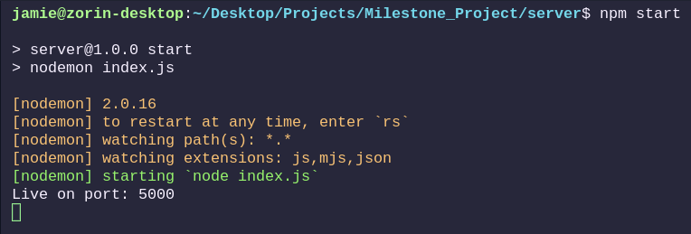
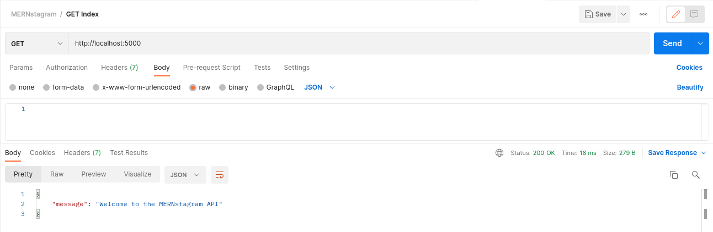
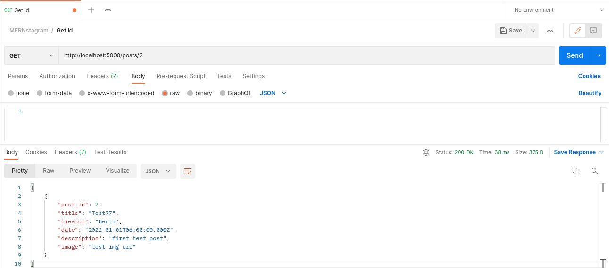
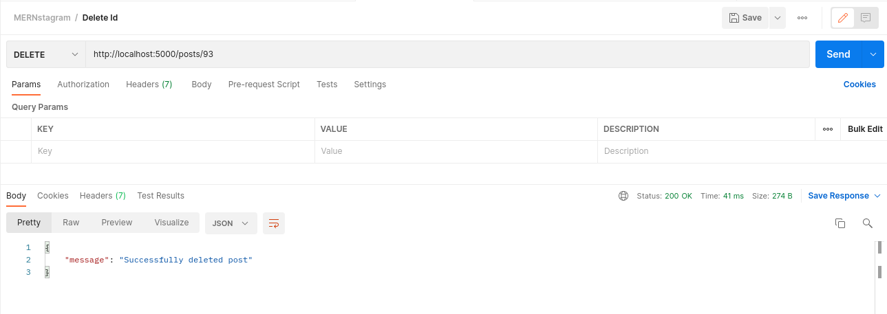

## MERNstagram Server Documentation ##

To start the API first 'cd' into the 'server' folder then run:

     npm install

 - Set your Port number in the .env file. 

Then:

     npm start

The API server should now be up and running:

## API Routes ##

The MERNstagram API has 5 routes currently as diagramed below in our routes table:
     
     | Method |       Path                   |                    Purpose                           |        Status       |
     | ------ | ---------------------------- | ---------------------------------------------------- | ------------------- |
     | GET    |     /                        |	API Entry Point / Homepage                          |         DONE        |
     | GET    |     /posts/:id               |	Index of specific id                                |         DONE        |
     | POST   |     /posts                   |	Create a new post                                   |         DONE        |   
     | PUT    |     /:id                     |	Update a post                                       |         DONE        |
     | DELETE |     /posts/:id               |	Delete a post                                       |         DONE        |

Postman Examples:

GET /:

GET /posts/:id:

POST /:

Image Here

PUT /:id:

Image Here

DELETE /posts/:id:

Current Bugs:

POST /:
     
     - Error message: 'null value in column "creator" violates not-null constraint'
     - Object will be created, but with no success value returned

